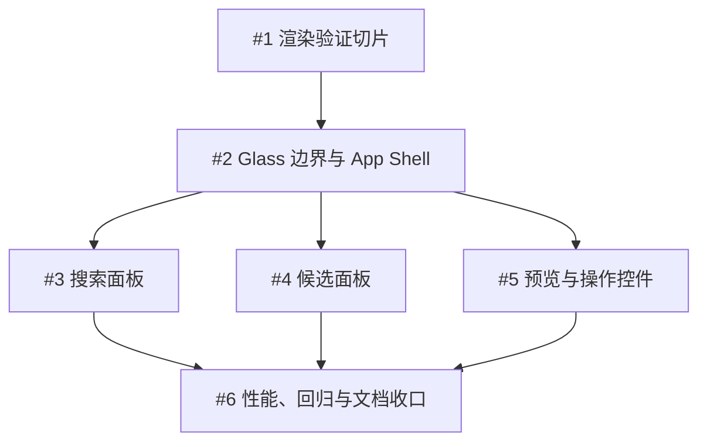

# SSSubtitle — Liquid Glass Easy 任务计划

> 本文是项目内的迁移导航；可执行任务以 GitHub Issues #1–#6 为准。
> 计划采用 Matt Pocock `to-tickets` 的 tracer-bullet 方式：每个 Issue 都能在一个新上下文中独立验收，并显式声明阻塞关系。

## 目标

在不改变字幕搜索、Subtitle Candidate 选择、Subtitle Preview、Acquisition、键盘快捷键或 Rust/FRB 业务契约的前提下，为 SSSubtitle 引入 `liquid_glass_easy` 的有限 Glass 视觉层。

目标不是把整个应用改成全玻璃，而是让 Glass 表达 App Shell、主要面板和少量浮动操作的层级；输入、列表和字幕阅读内容继续使用稳定、可读、轻量的 Material 3 表面。

## 当前边界

- SSSubtitle 当前直接使用 Flutter Material 3，`pubspec.yaml` 中没有 `material_ui`；本计划不包含 `material_ui` 迁移。
- 当前发布验证范围是 Windows 与 Web；Android 与 iOS 不属于项目支持目标，Linux 与 macOS 不作为发布门禁。
- Flutter 继续负责界面、键盘、无障碍、文件选择和平台保存；Rust、FRB 和字幕领域接口不因视觉改造而改变。
- `liquid_glass_easy` 直接使用应集中在 SSSubtitle 的 UI/theme 包装边界；业务页面优先使用 `AppGlass*` 接口。
- Glass 只用于 App Shell、搜索/候选/预览面板外壳和少量主要操作；TextField、候选列表项、Chip、字幕行和高频滚动内容保持普通 Material 或实体表面。
- 以 [官方包文档](https://pub.dev/packages/liquid_glass_easy) 为 API 与渲染行为依据。计划编写时官方页面显示版本为 `4.1.1`；最终版本以 Issue #1 的验证结果为准。

## 任务依赖

| 顺序 | Issue | 交付物 | 阻塞关系 |
| --- | --- | --- | --- |
| 1 | [#1 建立 Liquid Glass 渲染验证切片](https://github.com/Nicoeevee/SSSubtitle/issues/1) | 依赖、渲染后端、Light/Dark 和 Windows/Web 基线 | 无 |
| 2 | [#2 建立 Glass 表面边界并改造 App Shell](https://github.com/Nicoeevee/SSSubtitle/issues/2) | SSSubtitle 自有 Glass tokens/wrappers 与顶部外壳 | #1 |
| 3 | [#3 搜索面板](https://github.com/Nicoeevee/SSSubtitle/issues/3) | Glass 搜索面板，Material 输入和原有搜索行为 | #2 |
| 4 | [#4 候选面板](https://github.com/Nicoeevee/SSSubtitle/issues/4) | Glass 外壳 + 轻量候选列表 | #2 |
| 5 | [#5 预览与操作控件](https://github.com/Nicoeevee/SSSubtitle/issues/5) | 可读的 Glass 预览层与操作控件 | #2 |
| 6 | [#6 性能、回归与文档收口](https://github.com/Nicoeevee/SSSubtitle/issues/6) | Windows/Web 性能证据、端到端回归、文档和独立审查 | #3、#4、#5 |

## 执行规则

1. 开始一个任务前，先读取该 Issue 的完整内容和所有 `Blocked by` Issue；阻塞任务没有完成时，不提前实现后续切片。
2. #1 与 #2 按顺序完成；#3、#4、#5 在 #2 完成后可以并行，但每个切片仍需保持项目可运行、可测试。
3. 每个切片采用 red → green → refactor：先写能证明行为的测试或验证步骤，再实现 Glass 视觉变化，最后整理包装边界。
4. 每个 Issue 完成时，在 Issue 中逐项勾选验收条件，并附上实际验证证据：目标平台、Flutter/Dart 版本、渲染后端、运行状态、截图或日志。
5. 视觉实现完成不等于任务完成；只要键盘、Semantics、布局、可读性、滚动或性能验收未有证据，就保持 Issue 未完成。
6. #6 完成独立审查，分别检查实现是否符合项目规范和 Issues #1–#5 的验收条件。

## 统一验证门禁

按 [开发指南](../development.md) 中的质量命令和构建路径执行，并把结果写入对应 Issue：

- Dart 格式、Flutter 静态分析、Flutter 测试。
- Rust 格式、Rust 测试和 Clippy；只有当视觉改造意外触及 Rust 时才需要解释原因。
- Windows Release 构建与运行验证。
- Web Release 构建与浏览器运行验证，包含项目要求的跨源隔离响应头。
- Light/Dark、宽屏/紧凑窗口、窗口缩放、候选滚动、字幕正文滚动、搜索 loading 和保存 loading。
- 选择视频、编辑 Suggested Search Name、搜索、选择 Subtitle Candidate、分页浏览 Subtitle Preview、Acquisition、取消、错误/空结果以及全部既有键盘快捷键。

## 实验记录（2026-08-26）

一次独立 worktree 原型验证了 `liquid_glass_easy: 4.1.1` 的 API 和固定背景捕获路径，随后该 worktree 被移除，原型代码没有合并到 `main`。原型确认以下方向可行：使用单一 `LiquidGlassView` 包住完整 `Scaffold` 和固定程序化 Mesh Gradient；通过应用自有 `AppGlass*` wrapper 统一 Lens/style/token；把 TextField、候选列表与 Chip、字幕正文和高频滚动内容留在 Material 3；将 Noto Sans SC 静态资源与 OFL 许可证打包并关闭 Google Fonts runtime fetching。

原型的发布门禁结果与截图见[开发指南的实验记录](../development.md#liquid-glass-实验记录)及 [CanvasKit Web Glass 验收截图](../validation/liquid-glass-web-2026-08-26.png)。Windows Release、FRB Web Release、Flutter Web Release 和带 COOP/COEP 的本地服务均已验证；Web 页面通过 Chrome DevTools Protocol 确认 CanvasKit 首帧。Windows 的 Impeller 日志已取得，但桌面窗口截图、Light/Dark、缩放、滚动、loading、全流程交互和性能记录仍未完成，因此 Issues #1–#6 的验收状态不因本次实验自动关闭。

## 设计决策记录

- Glass 是视觉表面层，不是新的字幕业务框架。
- Material 3 负责内容密度、输入、列表、表格/文本和阅读可读性；Liquid Glass 负责浮层、层级和少量交互表面。
- 优先使用固定的 Glass Surface；不把 Lens 放入高频滚动列表，也不为每个候选项或字幕行创建 Lens。
- Skia 与 Impeller 的表现不能凭假设通过；#1 记录实际渲染路径，#6 记录最终性能和已知限制。
- 视觉迁移不应修改 `SubtitleController`、Rust subtitle core、FRB 接口或平台保存契约。

## 相关资料

- [Liquid Glass Easy 官方包文档](https://pub.dev/packages/liquid_glass_easy)
- [ADR-0001：Flutter 平台壳与 Rust Subtitle Core 职责边界](../adr/0001-flutter-platform-shell-rust-subtitle-core.md)
- [ADR-0002：三类异步字幕操作](../adr/0002-deepen-the-rust-subtitle-workflow.md)
- [项目开发指南](../development.md)
- [GitHub Issue 工作流](issue-tracker.md)
